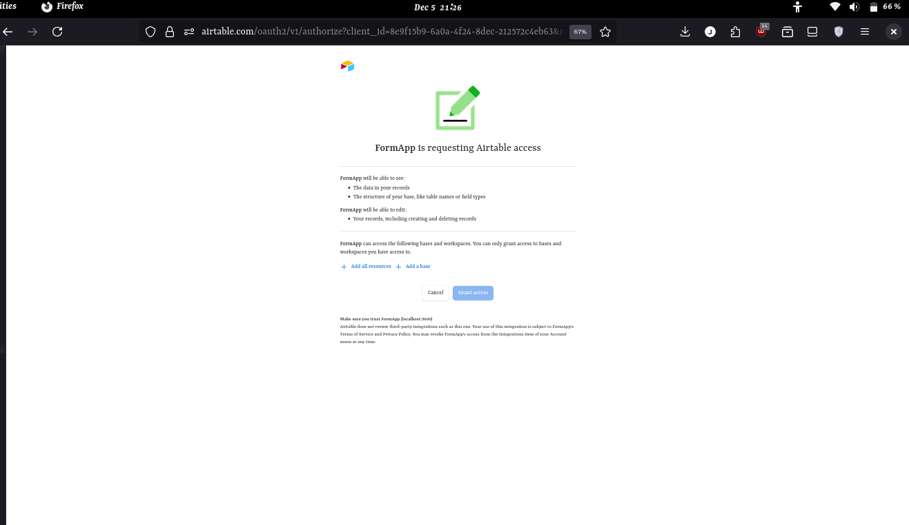
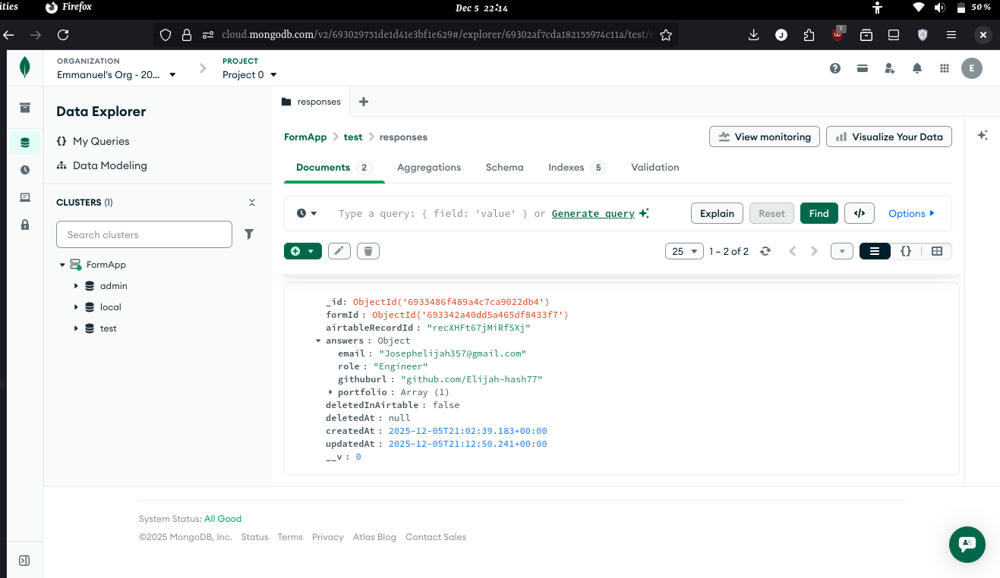
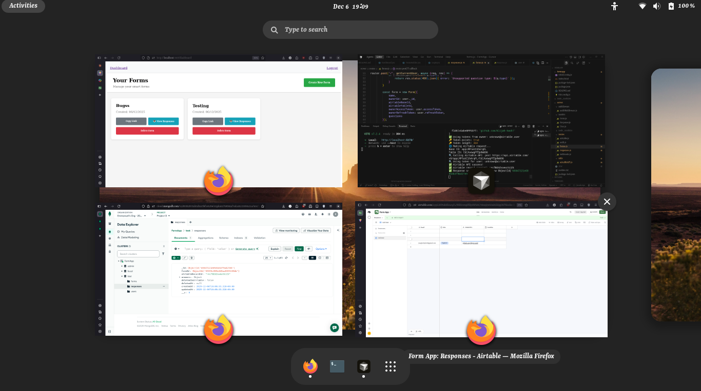
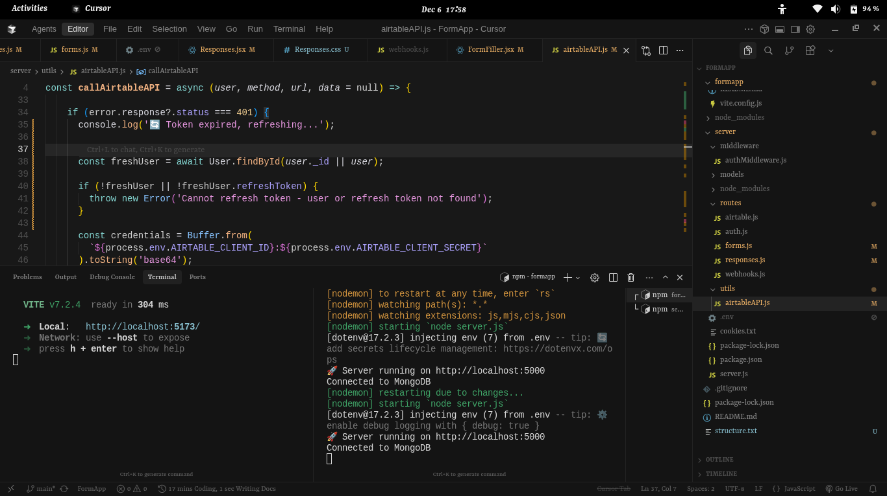
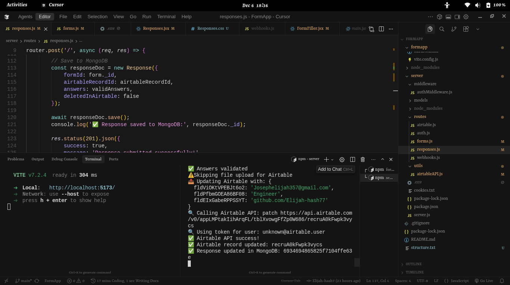

# FormApp

> A full-stack smart form builder that syncs responses to Airtable in real-time using OAuth 2.0, webhooks, and conditional logic.

Built to solve a real problem: collecting form responses and keeping them automatically in sync with Airtable — without manual exports or copy-pasting data.

🔗 [Live Demo](https://your-demo-link.com) · [View Repo](https://github.com/Elijah-hash7/FormApp)

---

## What This Actually Does

Most form tools either don't connect to Airtable at all, or only do one-way syncing. FormApp does bidirectional sync — when a record is deleted in Airtable, MongoDB flags it without losing the data (soft delete). When a user submits a form, the response lands in both MongoDB and Airtable simultaneously via webhooks.

The conditional logic engine means questions show or hide dynamically based on previous answers — built from scratch, not a library.

---

## Technical Highlights

**Airtable OAuth 2.0 Flow** — Full OAuth implementation with access tokens, refresh tokens, and scoped permissions (`data.records:read`, `data.records:write`, `schema.bases:read`). Not API key auth — proper OAuth like production apps use.

**Real-time Webhook Sync** — Airtable fires webhooks to the backend on record changes. The server processes these events and updates MongoDB state accordingly. Uses ngrok for local tunneling during development.

**Conditional Logic Engine** — Questions are rendered based on configurable rules with AND/OR logic and multiple operators (`equals`, `notEquals`, `contains`). Rules are stored per-question and evaluated client-side on each answer change.

**Soft Delete Architecture** — Records deleted in Airtable are flagged in MongoDB with `deletedInAirtable: true` rather than hard-deleted. This preserves response history while keeping the UI clean.

**JWT + Session Auth** — Dual auth layer: JWT for API requests, session-based auth for the OAuth callback flow.

---

## Architecture

```
Client (React + Vite)
    ↓
Express API (Node.js)
    ↓              ↓
MongoDB        Airtable API
    ↑
Airtable Webhooks (real-time sync)
```

---

## Tech Stack

| Layer | Tech |
|---|---|
| Frontend | React, React Router, Vite |
| Backend | Node.js, Express |
| Database | MongoDB |
| Auth | JWT, Session, Airtable OAuth 2.0 |
| Sync | Airtable Webhooks, ngrok |

---

## Quick Start

### Backend
```bash
cd server
npm install
cp .env.example .env  # fill in your values
npm run dev
```

### Frontend
```bash
cd formapp
npm install
npm run dev
```

### Environment Variables
```env
MONGO_URI=mongodb://localhost:27017/formapp
AIRTABLE_CLIENT_ID=your_client_id
AIRTABLE_CLIENT_SECRET=your_client_secret
AIRTABLE_REDIRECT_URI=http://localhost:5000/api/airtable/callback
JWT_SECRET=your_secret_key
SESSION_SECRET=your_session_secret
PORT=5000
WEBHOOK_BASE_URL=https://your-ngrok-url.ngrok-free.app
```

---

## Conditional Logic Schema

```js
conditionalRules: {
  logic: "AND",  // or "OR"
  conditions: [{
    questionKey: "role",
    operator: "equals",  // equals | notEquals | contains
    value: "Engineer"
  }]
}
```

---

## API Endpoints

| Method | Endpoint | Description |
|---|---|---|
| POST | `/api/forms` | Create a new form |
| GET | `/api/forms/user/forms` | Get all forms for user |
| POST | `/api/responses` | Submit a form response |
| GET | `/api/responses/forms/:formId/responses` | Get responses for a form |
| DELETE | `/api/responses/:responseId` | Soft delete a response |
| POST | `/api/airtable/bases/:baseId/webhook` | Register Airtable webhook |

---

## Screenshots







---

## What I Learned Building This

- How OAuth 2.0 flows actually work end-to-end, not just theory
- Designing webhook receivers that handle duplicate events gracefully
- Why soft deletes matter in systems with external data sources
- Structuring a Node.js backend for both REST and event-driven patterns
